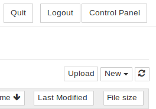
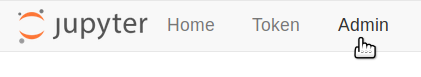
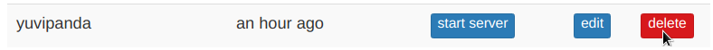

## JupyterHub programming environment with student Notebooks

#### Secondary schools may want to consider JupyterHub to integrate coding with dynamic interactive graphing — A New Way to Think About Programming — allowing students to integrate science experiment results and program output within their own blog-like "Jupyter Notebooks."

* Jupyter Notebooks are widely used in the scientific community:
  * [Institutional FAQ](https://jupyterhub.readthedocs.io/en/stable/getting-started/institutional-faq.html)
  * [Getting Started](https://jupyterhub.readthedocs.io/en/stable/getting-started/)
* Students create their own accounts on first use — e.g. at http://box.lan/jupyterhub — just as if they're logging in regularly (unfortunately the login screen doesn't make that clear, but the teacher _does not_ need to be involved!)
  * A student can then sign in with their username and password, to gain access to their files (Jupyter Notebooks).
  * The teacher should set and protect JupyterHub's overall ``Admin`` password, just in case.  As with student accounts, the login screen doesn't make that clear — so just log in with username `Admin` using any password that you want to become permanent.
* Individual student folders are created in ``/var/lib/private/`` on the Internet-in-a-Box (IIAB) server:
  * A student will only be able to see their own work — they do not have privileges outside of their own folder.
  * Students may upload Jupyter Notebooks to the IIAB server, and download the current state of their work via a normal browser.

### Settings

Linux administrators please see `/opt/iiab/jupyterhub/etc/jupyterhub/jupyterhub_config.py` which originates from:

https://github.com/iiab/iiab/blob/master/roles/jupyterhub/templates/jupyterhub_config.py

Note that `/opt/iiab/jupyterhub` is a Python 3 virtual environment, that can be activated with the usual formula:

```
source /opt/iiab/jupyterhub/bin/activate
```

### PAWS/Jupyter Notebooks for Python Beginners

While PAWS is a little bit off topic, if you have an interest in Wikipedia, please do see this 23m 42s video ["Intro to PAWS/Jupyter notebooks for Python beginners"](https://www.youtube.com/watch?v=AUZkioRI-aA&list=PLeoTcBlDanyNQXBqI1rVXUqUTSSiuSIXN&index=8) by Chico Venancio, from 2021-06-01.

He explains PAWS as a "powerful Python execution environment http://paws.wmcloud.org [allowing] ordinary folks to write interactive scripts to work with Wikimedia content."

### Users changing their own password
Users can change their password by first logging into their account and then visiting the url http://box.lan/jupyterhub/auth/change-password.

This is the only way to change the admin password, because the Admin screen does not permit deletion of the admin account. It will be necessary to restart jupyterhub before the changed password becomes effective:
```
sudo systemctl restart jupyterhub
```
### Starting the Admin Panel, and changing user passwords
The admin can reset user passwords by deleting the user from the JupyterHub admin page. This logs the user out, but does not remove any of their data or home directories. The user can then set a new password by logging in again with their new password.

1. As an admin user, open the Control Panel by clicking the control panel button on the top right of your JupyterHub.



2. In the control panel, open the Admin link in the top left.



This opens up the JupyterHub admin page, where you can add / delete users, start / stop peoples’ servers and see who is online.

3. Delete the user whose password needs resetting. Remember this does not delete their data or home directory.



If there is a confirmation dialog, confirm the deletion. This will also log the user out if they were currently running.

4. Re-create the user whose password needs resetting within that same dialog.

5. Ask the user to log in again with their new password as usual. This will be their new password going forward.Users changing their own password
Users can change their password by first logging into their account and then visiting the url <your_server_ip>/hub/auth/change-password.


