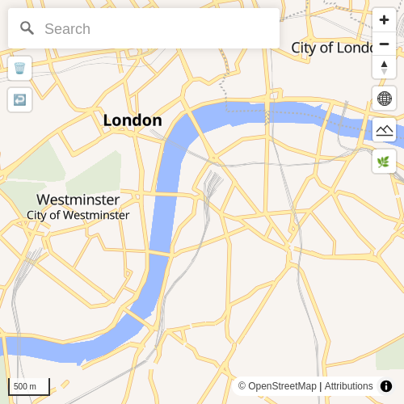
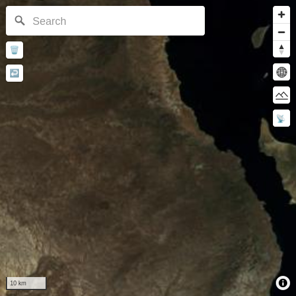
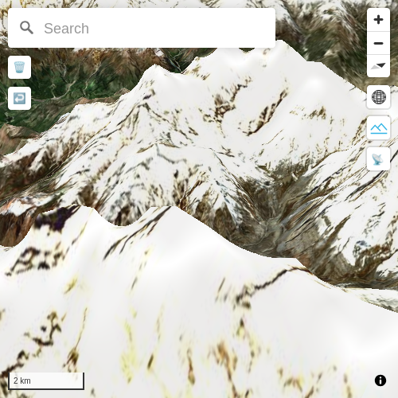
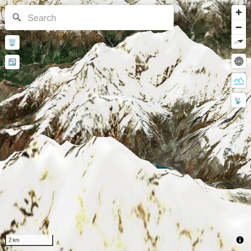
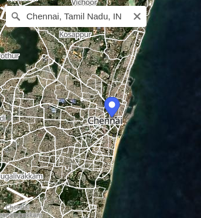

# IIAB Maps

The new IIAB Maps lets you choose a configuration that works for you. Because we know your disk space is limited, we give you multiple quality options, in each of these 4 areas:

- [OpenStreetMap or Natural Earth](#how-do-i-try-iiabs-new-maps-as-of-march-2026) (vector)
- [Satellite Photos](#how-do-i-try-iiabs-new-maps-as-of-march-2026) (raster)
- [Terrain](#what-about-3d-terrain) (optional 3D elevation data)
- ​[Map search](#can-i-try-out-search) (e.g. to find cities and towns)

NEW: Need more detail in specific areas, in addition to the above global maps? IIAB implementers/operators can download "[Full Quality Regions](#full-quality-regions-experimental)" for parts of the world that are especially important to their community. These high-res rectangular regions provide _maximum_ graphical detail, without using up too much disk space.

## How do I try IIAB's new maps as of March 2026?

To configure your map, set the following variables (for the options you choose!) in [/etc/iiab/local_vars.yml](https://wiki.iiab.io/go/FAQ#What_is_local_vars.yml_and_how_do_I_customize_it?) before installing IIAB software:

1. If you want **~170 MB** = 85 MB vector (Lower detail, up to zoom 8, from Natural Earth) + 85 MB satellite (up to zoom 7), 

   ```
   osm_vector_maps_install: False
   osm_vector_maps_enabled: False

   maps_install: True
   maps_enabled: True

   maps_vector_quality: ne
   maps_satellite_zoom: 7
   ```


2. Or if you want **~3.1 GB** = 1.9 GB vector (Higher detail, up to zoom 9, from OpenStreetMap) + 1.2 GB satellite (up to zoom 9), include:

   ```
   maps_vector_quality: osm-z9
   maps_satellite_zoom: 9
   ```




3. Or if you want **~168 GB** = 78 GB vector (Higher detail, up to zoom 14, including 3D buildings, from OpenStreetMap) + 80 GB satellite (up to zoom 12), include:

   ```
   maps_vector_quality: osm-full
   maps_satellite_zoom: 12
   ```


See `maps_dot_black_vector_tiles` and `maps_dot_black_satellite_tiles` [here](https://github.com/iiab/iiab/blob/master/roles/maps/defaults/main.yml) for all valid values.

## What about 3D terrain?

To add 3D (three-dimensional) terrain files, you can set this optional setting. You may find that when looking at mountains, high quality satellite imagery may compensate for low quality terrain, and vice versa.

PREREQ: Confirm [IIAB Maps]((#how-do-i-try-iiabs-new-maps-as-of-march-2026)) (with global vector/satellite data) is installed!

1. If you want **~980 MB** terrain maps (up to zoom 7), include:
   ```
   maps_terrain_zoom: 7
   ```


2. If you want **~6.4 GB** terrain maps (up to zoom 8), include:
   ```
   maps_terrain_zoom: 8
   ```



3. If you want **~29 GB** terrain maps (up to zoom 9), include:
   ```
   maps_terrain_zoom: 9
   ```



4. If you want **~106 GB** terrain maps (up to zoom 10), include:
   ```
   maps_terrain_zoom: 10
   ```


See `maps_dot_black_terrain_tiles` [here](https://github.com/iiab/iiab/blob/master/roles/maps/defaults/main.yml) for all valid values.

## Can I try out search?

PREREQ: Confirm [IIAB Maps]((#how-do-i-try-iiabs-new-maps-as-of-march-2026)) (with global vector/satellite data) is installed!

### Low-power search

This option is good for all devices. Fast and simple, but limited features.

Allows users to search for any city or town with population 1000 or higher (**~35MB**).

   ```
   maps_search_engine: static
   maps_search_static_db: pop-1k-cities
   ```




### High-power search (which is still experimental)

These options are not recommended for very low-power devices such as Raspberry Pi [Zero 2 W](https://www.raspberrypi.com/products/raspberry-pi-zero-2-w/), though this might change.

As of this writing it includes only administrative (i.e. political) regions and natural features.

1. For **~640 MB** "small" (only California, as of this writing) search:

   ```
   maps_search_engine: nominatim
   maps_search_nominatim_db: basic
   ```

2. For **~67 GB** "full" (planet-wide) search:

   ```
   maps_search_engine: nominatim
   maps_search_nominatim_db: full
   ```

## Full Quality Regions (experimental)

You can download rectangular "Full Quality Regions" to supplement your lower-resolution world map. The goal is to provide your community with the latest high-res vector, satellite and terrain data for the regions they care about most.

PREREQ: Confirm [IIAB Maps]((#how-do-i-try-iiabs-new-maps-as-of-march-2026)) (with global vector/satellite data) is installed!

### Installation

In order to turn it on, add the following setting: (e.g. in [/etc/iiab/local_vars.yml](https://wiki.iiab.io/go/FAQ#What_is_local_vars.yml_and_how_do_I_customize_it?))

```
maps_region_downloader: true
```

Reinstall the new IIAB Maps, if already installed:

```
cd /opt/iiab/iiab
sudo ./install --reinstall maps
```

### Downloading Regions

Open your map. You will find a new button on the top left:


If you click it, you'll enter a new "drawing" mode. You'll see your cursor change.

Draw a rectangle that represents the region you want to download. To draw, click one corner of the rectangle and then the opposite corner. **(Make sure to only click, do not drag!)**.

Once you have a rectangle, you'll immediately see a pop-up in the middle of it:


Follow the instructions on the pop-up to download your region.

### Viewing Regions

You can test out your downloaded Full Quality Region by clicking on the new rectangle on the map. You should be able to see everything at full quality (terrain up to zoom level 10).

### Deleting Regions

To delete a region, first make sure you are "inside" that region (instead of the full world map). Once there, you should see a delete button on the top left:


When you click it, it will bring up another pop-up with instructions on how to delete the region.

### Overlapping Regions

At the moment, overlapping regions are not allowed. However, if you find that you want to expand a region, you can always delete it and download a larger one instead.

### Final Setup for Users

Finally, once your Full Quality Regions are in place and you are ready to let others use your map, you can turn off the setting:

```
maps_region_downloader: false
```

...and run the `maps` role again. At this point, you will be able to view your Full Quality Regions, but the Download and Delete buttons will be gone.

## Installation Tips

For large file downloads:

* If there is an interruption and you need to run it again, it should resume where it left off.
* If you want to see download progress, read the Ansible output for instructions.

## Further options & detail:

* https://github.com/iiab/iiab/blob/master/roles/maps/defaults/main.yml
* [PR #4120](https://github.com/iiab/iiab/pull/4120)
* Map data files as of 2025-12-10: https://iiab.switnet.org/maps/1/
* IIAB integration thanks to [Dan Krol](https://github.com/orblivion)

## Next Steps

What I hope to be working on in the next few months

**March 2026**:

* Search fixes (search for two-letter words)
* Smarter sorting (Distance, word length)
* Region downloader (Better error messages, pick download mirror randomly)

**April 2026**:

* Adding more data to static search
    * Add natural features, historical places, etc
    * Search optimizations for large databases
    * Sorting non-cities (natural feature, etc) vs cities. Cannot rely on population anymore.
    * Even if this becomes "big", we should keep a small database around as an option.

**May 2026**:

* Split search by region and include as part of "Full quality region" downloads
    * (assuming the database is big enough to merit splitting)
* UI improvements (Out-of-box experience, Navigating regions, Buttons, Searching while viewing a region)

## Extra attributions:

* UI
  * https://github.com/maps-black/maps.black#readme
  * https://github.com/maplibre/maplibre-gl-js
  * https://github.com/maplibre/maplibre-gl-geocoder?tab=ISC-1-ov-file#readme
  * https://github.com/watergis/maplibre-gl-terradraw
* Search (for now):
  * https://github.com/osm-search/Nominatim?tab=GPL-3.0-1-ov-file#readme
  * https://github.com/jacopofar/static-osm-indexer/?tab=readme-ov-file#licensing-anc-crediting (some pieces and inspiration taken from this project)
* Other credits: https://github.com/iiab/iiab/blob/master/roles/www_base/files/html/html/credits.html
