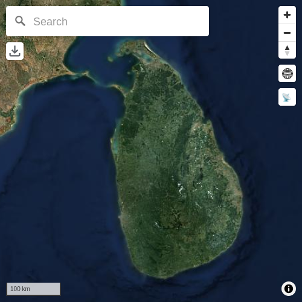
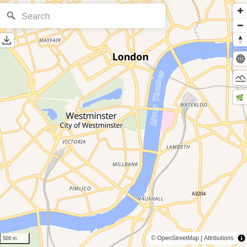
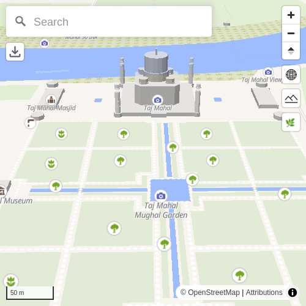
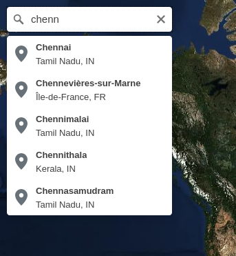
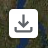
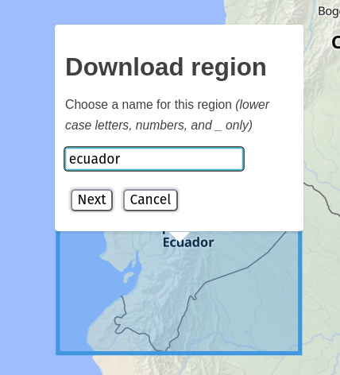

# IIAB Maps

[Internet-in-a-Box (IIAB)](https://internet-in-a-box.org/) Maps is similar to Google Maps, but better suited for schools: it works offline (including satellite photos, and 3D terrain) and avoids all advertising!

The new IIAB Maps (as of 2025 and 2026) lets you choose among multiple quality options — in each of these 4 areas — because we know your disk space is limited:

- [OpenStreetMap or Natural Earth](#whats-a-minimum-iiab-maps-install) (vector)
- [Satellite Photos](#whats-a-minimum-iiab-maps-install) (raster)
- [Terrain](#how-do-i-install-3d-terrain) (optional 3D elevation data)
- ​[Map Search](#how-do-i-install-map-search) (e.g. to find cities and towns)

NEW: Do you want vivid detail in specific areas, in addition to the above global maps?  IIAB implementers/operators can download "[Full Quality Regions](#full-quality-regions)" for parts of the world that are especially important to their community.  These high-res rectangular regions provide _maximum_ graphical detail, without using up too much disk space.

Follow the instructions below, so that your IIAB users will be able browse IIAB Maps at http://box/maps or http://10.10.10.10/maps

## What's a minimum IIAB Maps install?

You need to decide (A) how much global vector detail... and (B) how much global satellite photo detail... your community needs!

Here are 3 examples below, to help you decide what you'll put in [/etc/iiab/local_vars.yml](https://wiki.iiab.io/go/FAQ#What_is_local_vars.yml_and_how_do_I_customize_it?) (do this before installing IIAB software!)

1. If you want **~170 MB** = 85 MB vector (Lower detail, up to [zoom level](https://wiki.openstreetmap.org/wiki/Zoom_levels) 8 [users can overzoom to zoom 12], from [Natural Earth](https://www.naturalearthdata.com/) a.k.a. "ne") + 85 MB satellite (up to zoom 7):

   ```
   osm_vector_maps_install: False
   osm_vector_maps_enabled: False

   maps_install: True
   maps_enabled: True

   maps_vector_quality: ne
   maps_satellite_zoom: 7
   ```




2. Or if you want **~9.5 GB** = 8.3 GB vector (Higher detail, up to zoom 11 [users can overzoom to zoom 15], from OpenStreetMap) + 1.2 GB satellite (up to zoom 9), include:

   ```
   maps_vector_quality: osm-z11
   maps_satellite_zoom: 9
   ```




3. Or if you want **~160 GB** = 80 GB vector (Higher detail, up to zoom 14 [users can overzoom to zoom 18], including 3D buildings, from OpenStreetMap) + 80 GB satellite (up to zoom 12), include:

   ```
   maps_vector_quality: osm-z14
   maps_satellite_zoom: 12
   ```




See `maps_dot_black_vector_tiles` and `maps_dot_black_satellite_tiles` [here](https://github.com/iiab/iiab/blob/master/roles/maps/defaults/main.yml) for all valid values.

## How do I install 3D terrain?

To add 3D (three-dimensional) terrain files, you can set this optional setting.  You may find that when looking at mountains, high quality satellite imagery may compensate for low quality terrain, and vice versa.

PREREQ: Confirm that at least a [minimum IIAB Maps](#whats-a-minimum-iiab-maps-install) is installed!

1. If you want **~980 MB** terrain maps (up to zoom 7), include:
   ```
   maps_terrain_zoom: 7
   ```


2. If you want **~6.4 GB** terrain maps (up to zoom 8), include:
   ```
   maps_terrain_zoom: 8
   ```


3. If you want **~29 GB** terrain maps (up to zoom 9), include:
   ```
   maps_terrain_zoom: 9
   ```


4. If you want **~106 GB** terrain maps (up to zoom 10), include:
   ```
   maps_terrain_zoom: 10
   ```


See `maps_dot_black_terrain_tiles` [here](https://github.com/iiab/iiab/blob/master/roles/maps/defaults/main.yml) for all valid values.

## How do I install Map Search?

PREREQ: Confirm that at least a [minimum IIAB Maps](#whats-a-minimum-iiab-maps-install) is installed!

### Low-power Search

This option is good for all devices.  Fast and simple, but limited features.

Allows users to search for any city or town with population 1000 or higher (**~35MB**).

   ```
   maps_search_engine: static
   maps_search_static_db: pop-1k-cities
   ```




### High-power Search (experimental)

These options are not recommended for very low-power devices such as Raspberry Pi [Zero 2 W](https://www.raspberrypi.com/products/raspberry-pi-zero-2-w/), though this might change.

As of April 2026, it includes only administrative (i.e. political) regions and natural features.

1. For **~640 MB** "small" search (only California as of April 2026):

   ```
   maps_search_engine: nominatim
   maps_search_nominatim_db: basic
   ```

2. For **~67 GB** "full" (planet-wide) search:

   ```
   maps_search_engine: nominatim
   maps_search_nominatim_db: full
   ```

## Full Quality Regions

You can download rectangular "Full Quality Regions" (FQRs) to supplement your lower-resolution world map.  The goal is to provide your community with the latest high-res vector, satellite and terrain data for the regions they care about most.

DETAILS: IIAB's downloadable regions (FQRs) include OpenStreetMap vector data up to [zoom level](https://wiki.openstreetmap.org/wiki/Zoom_levels) 14 (overzoomable to about zoom level 18), satellite photo data up to zoom level 13, and 3D terrain up to zoom level 10.  (As of April 2026, [Map Search data](#how-do-i-install-map-search) is not yet affected, no matter how many FQR regions you download!)

### Prerequisites

1. Confirm that at least a [minimum IIAB Maps](#whats-a-minimum-iiab-maps-install) is installed.

2. Check that your IIAB has the following setting:  (e.g. in [/etc/iiab/local_vars.yml](https://wiki.iiab.io/go/FAQ#What_is_local_vars.yml_and_how_do_I_customize_it?))

   ```
   maps_region_downloader: True
   ```

3. If your IIAB doesn't have the above setting, then you need to enact it, and then run:

   ```
   cd /opt/iiab/iiab
   sudo ./runrole --reinstall maps
   ```

### Downloading Regions

Open your IIAB Maps, e.g. by browsing to http://box/maps or http://10.10.10.10/maps

Look for this button in the top-left:



Click the button to enter "drawing" mode (your mouse pointer should change).

Draw a rectangle that represents the region you want to download.  To draw, click one corner of the rectangle and then the opposite corner.  **(Make sure to only click, do not drag!)**

Once you have a rectangle, you'll immediately see a pop-up in the middle of it:



Follow the instructions on the pop-up to download your region.

### Viewing Regions

You can test out your downloaded Full Quality Region by clicking on the new rectangle on the map.  You should be able to see everything at full quality (terrain up to zoom level 10).

### Deleting Regions

To delete a region, first make sure you are "inside" that region (instead of the full world map).  Once there, you should see a Delete button on the top left:


When you click it, it will bring up another pop-up with instructions on how to delete the region.

### Overlapping Regions

At the moment, overlapping regions are not allowed.  However, if you find that you want to expand a region, you can always delete it and download a larger one instead.

### Final Setup for Users

Once your Full Quality Regions are in place and ready for others to browse, you can turn off downloading of additional regions in `/etc/iiab/local_vars.yml` by setting:

```
maps_region_downloader: False
```

Finalize the setting by reinstalling the `maps` role:

```
cd /opt/iiab/iiab
sudo ./runrole --reinstall maps
```

Once that completes, the Download and Delete buttons should be gone (for anybody who reloads http://box/maps or http://10.10.10.10/maps).

## Testing

If you are installing IIAB Maps for testing purposes (QA, CI, etc), there are "ultra-small" maps that you can install.  These are too small[*] for useful map browsing, but still usable enough for QA testers.

[*] Grand total disk usage is [~66 MB instead of the ~312 MB delivered by default_vars.yml](https://github.com/iiab/iiab/pull/4324), as of March 2026.

   ```
   maps_ne6_zoom: ci

   maps_vector_quality: osm-z1
   maps_satellite_zoom: 4

   maps_search_engine: static
   maps_search_static_db: pop-100k-cities

   maps_region_downloader: True
   ```

## Installation Tips

For large file downloads:

* If there is an interruption and you need to run it again, it should resume where it left off.
* If you want to see download progress, read the Ansible output for instructions.

## How to change or upgrade your IIAB Maps

If your IIAB was installed many months ago (or many years ago), it's far better to start from scratch [installing a completely new version of IIAB](https://wiki.iiab.io/go/FAQ#Is_a_quick_installation_possible?).

If your IIAB was installed quite recently, it's usually safe to update your IIAB software: (at your own risk, if your IIAB is online, and has enough disk space!)

```
cd /opt/iiab/iiab
sudo git pull
```

After [changing any IIAB Maps variables](#whats-a-minimum-iiab-maps-install) in `/etc/iiab/local_vars.yml`, you can now "reinstall" IIAB Maps to enact your new settings, by running:

```
sudo ./runrole maps --reinstall
```

## Further options & detail:

* https://github.com/iiab/iiab/blob/master/roles/maps/defaults/main.yml
* [PR #4120](https://github.com/iiab/iiab/pull/4120)
* Map data files as of 2025-12-10: https://iiab.switnet.org/maps/1/
* IIAB integration thanks to [Dan Krol](https://github.com/orblivion)

## Next Steps

What I hope to be working on in the next few months

~**March 2026**:~

* Search fixes (search for two-letter words)
* Smarter sorting (Distance, word length)
* Region downloader (Better error messages, pick download mirror randomly)

**April 2026**:

* Adding more data to static search
    * Add natural features, historical places, etc
    * Search optimizations for large databases
    * Sorting non-cities (natural feature, etc) vs cities.  Cannot rely on population anymore.
    * Even if this becomes "big", we should keep a small database around as an option.

**May 2026**:

* Split search by region and include as part of "Full quality region" downloads
    * (assuming the database is big enough to merit splitting)
* UI improvements (Out-of-Box experience, Navigating regions, Buttons, Searching while viewing a region)

## Extra attributions:

* UI
  * https://github.com/maps-black/maps.black#readme
  * https://github.com/maplibre/maplibre-gl-js
  * https://github.com/maplibre/maplibre-gl-geocoder?tab=ISC-1-ov-file#readme
  * https://github.com/watergis/maplibre-gl-terradraw
* Search (for now):
  * https://github.com/osm-search/Nominatim?tab=GPL-3.0-1-ov-file#readme
  * https://github.com/jacopofar/static-osm-indexer/?tab=readme-ov-file#licensing-anc-crediting (some pieces and inspiration taken from this project)
* Other credits: https://github.com/iiab/iiab/blob/master/roles/www_base/files/html/html/credits.html
