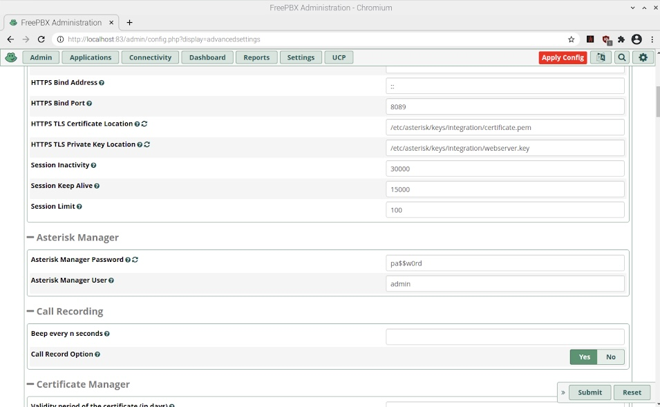
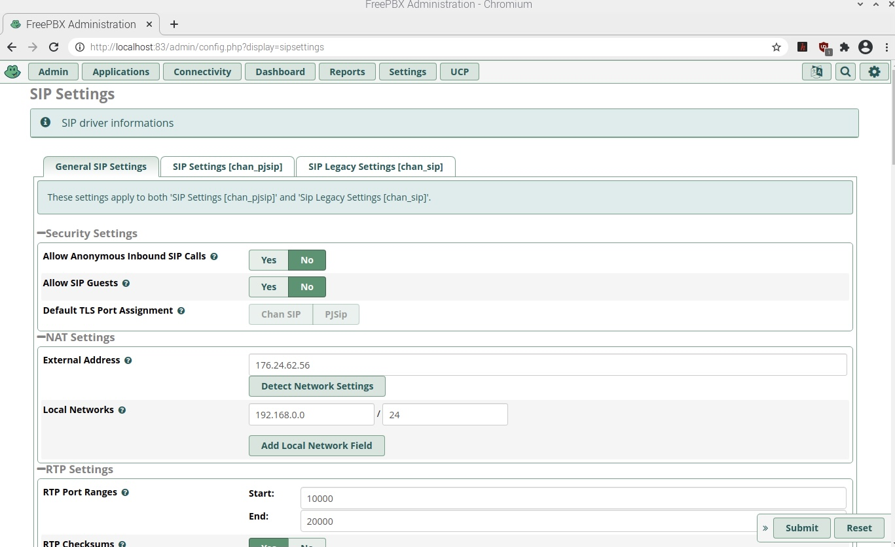
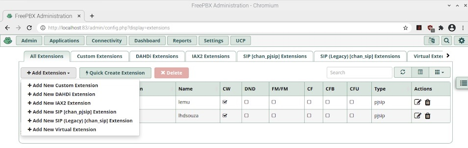
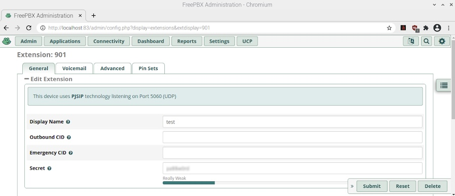
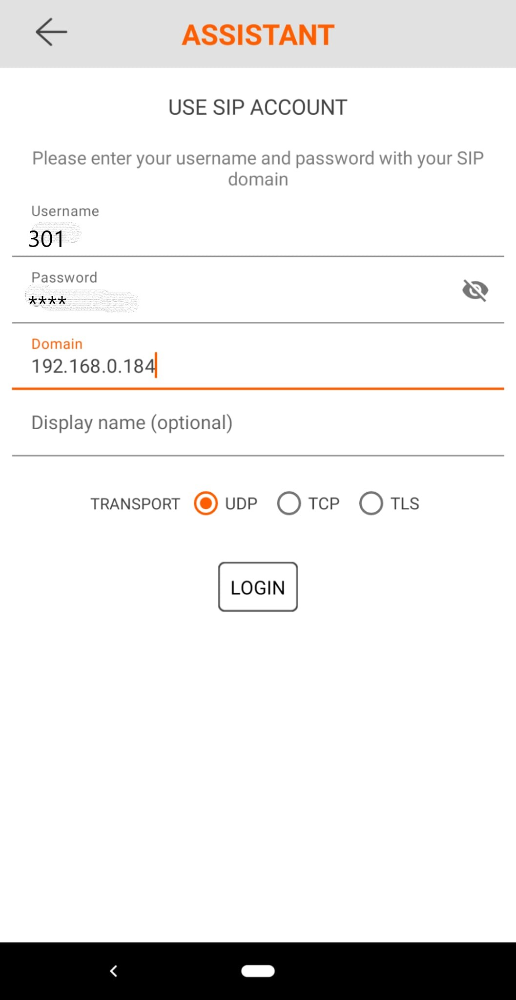
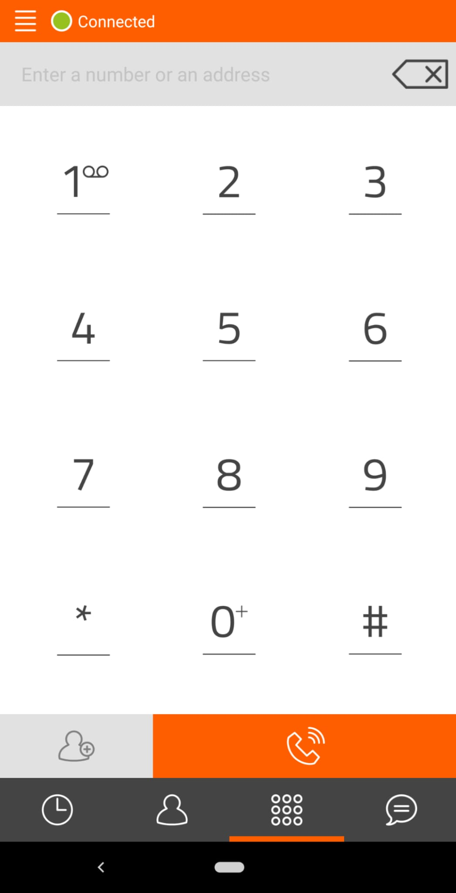
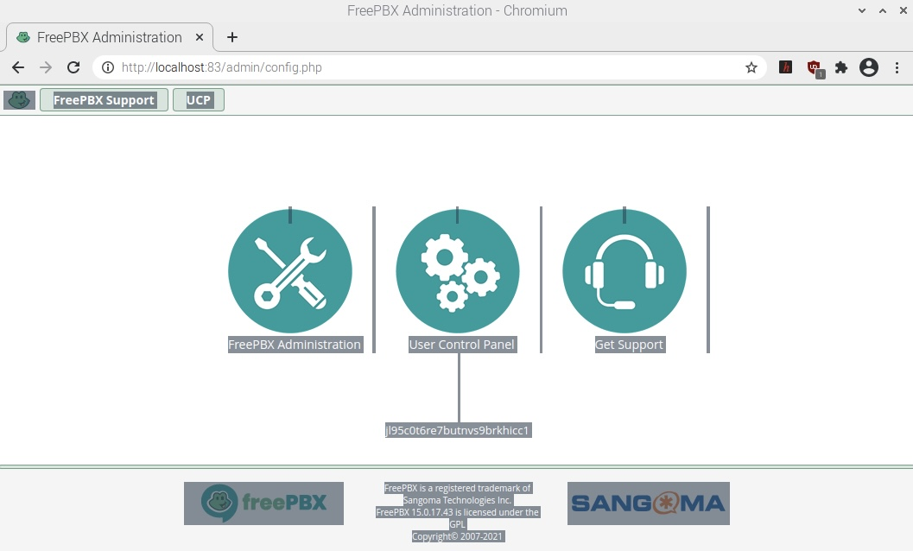
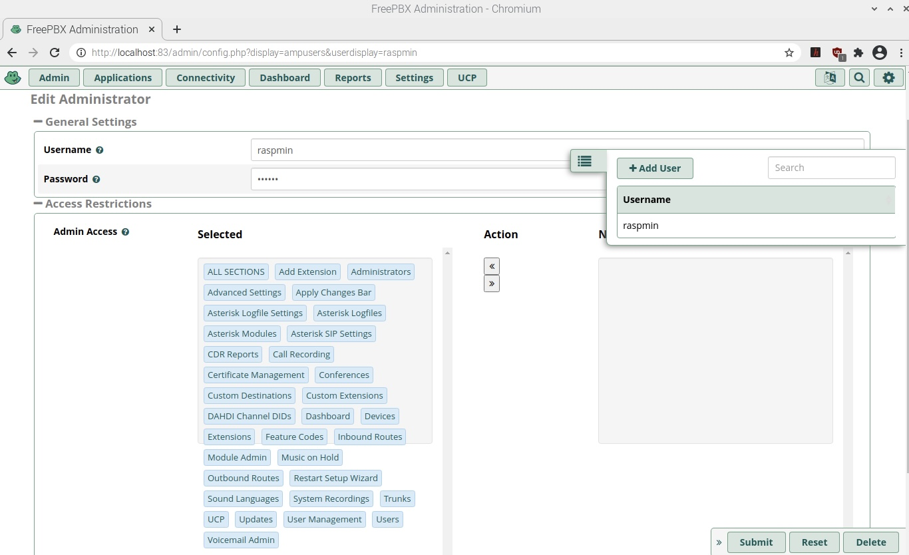

= PBX README
:toc: preamble
:toc-title:

https://internet-in-a-box.org[Internet-in-a-Box (IIAB)] can install https://asterisk.org/[Asterisk] and https://freepbx.org/[FreePBX] for Voice over IP (VoIP) calls using regular Android and iPhone softphone (SIP) apps — e.g. for low-cost and rural telephony.

As of April 2022, IIAB installs https://wiki.asterisk.org/wiki/display/AST/Asterisk+19+Documentation[Asterisk 19] and https://www.freepbx.org/freepbx-16-is-now-released-for-general-availability/[FreePBX 16].

PHP 7.4 is REQUIRED (https://github.com/iiab/iiab/pull/2899[PR #2899]) and PHP 8.x does not yet work (https://github.com/iiab/iiab/pull/3019#issuecomment-962469346[PR #3109]) &mdash; so please consider installing this on https://github.com/iiab/iiab/wiki/IIAB-Platforms#operating-systems[Ubuntu 20.04, Debian 11, or Raspberry Pi OS 11 "Bullseye"].

////
As of August 2021, IIAB installs https://wiki.asterisk.org/wiki/display/AST/Asterisk+18+Documentation[Asterisk 18] and https://www.freepbx.org/freepbx-16-beta-is-here/[FreePBX 16 Beta], as required by the latest PHP 7.4 Linux OS's (https://github.com/iiab/iiab/pull/2899[PR #2899]).  Please consider installing this on https://github.com/iiab/iiab/wiki/IIAB-Platforms#operating-systems[Ubuntu 20.04+, Debian 11 — or the imminent Raspberry Pi OS 11 "Bullseye"].

_PLEASE UNDERSTAND THIS MEANS THAT: IIAB no longer supports FreePBX 15 (Linux with PHP < 7.4, e.g. Raspberry Pi OS 10 "Buster").  Thank you for your understanding, as we look to the future together!_

_Upcoming:_ IIAB will consider supporting Asterisk 19, on or around its 2021-09-28 expected release date (https://github.com/iiab/iiab/issues/2934[#2934]).

_Historical:_ Back in February 2019, IIAB had installed Asterisk 16 and FreePBX 15, e.g. for Ubuntu 18.04, Debian 9 "Stretch" and experimentally, Raspberry Pi (https://github.com/iiab/iiab/issues/1467[#1467]).
////

== What Asterisk & FreePBX do

https://en.wikipedia.org/wiki/Asterisk_(PBX)[Asterisk] is a software implementation of a private branch exchange (PBX).  In conjunction with suitable telephony hardware interfaces and network applications, Asterisk is used to establish and control telephone calls between telecommunication endpoints, such as customary telephone sets, destinations on the public switched telephone network (PSTN), and devices or services on Voice over Internet Protocol (VoIP) networks.  Its name comes from the asterisk (*) symbol for a signal used in dual-tone multi-frequency (DTMF) dialing.

https://en.wikipedia.org/wiki/FreePBX[FreePBX] is a web-based open source GUI (graphical user interface) that controls and manages Asterisk (PBX), the open source communications server.

== Install it

. As you begin installing Internet-in-a-Box (IIAB) from http://download.iiab.io[download.iiab.io], it will prompt you:
+
----
Edit /etc/iiab/local_vars.yml to customize your Internet-in-a-Box? [Y/n]
----
+
Accept the challenge!  Make sure your IIAB configuration file (http://wiki.laptop.org/go/IIAB/FAQ#What_is_local_vars.yml_and_how_do_I_customize_it.3F[/etc/iiab/local_vars.yml]) contains:
+
----
pbx_install: True
pbx_enabled: True
----
+
FreePBX can be used with either or both web servers, NGINX on port 80 (as is new) and/or Apache on port 83 (as is traditional).
+
If you don't want Apache installed on your IIAB, and you prefer NGINX's shorter URL (http://box/freepbx), optionally set this line in your http://wiki.laptop.org/go/IIAB/FAQ#What_is_local_vars.yml_and_how_do_I_customize_it.3F[/etc/iiab/local_vars.yml] prior to installing IIAB:
+
----
pbx_use_apache: False
----
+
Or, if you want to use FreePBX with Apache alone (http://box:83/freepbx), optionally set this line in your /etc/iiab/local_vars.yml:
+
----
pbx_use_nginx: False
----
+
If using PBX intensively, please adjust `/etc/php/X.Y/apache2/php.ini`, `/etc/php/X.Y/cli/php.ini` and/or `/etc/php/X.Y/nginx/php.ini` (where `X.Y` is typically 7.4) as outlined within https://github.com/iiab/iiab/blob/master/roles/www_options/tasks/main.yml#L88-L131[/opt/iiab/iiab/roles/www_options/tasks/main.yml] &mdash; some of which happens automatically if you also set:
+
----
nginx_high_php_limits: True
----
+
Optionally, you may want to enable https://github.com/wdoekes/asterisk-chan-dongle[chan_dongle], which is a channel driver for Huawei UMTS cards (e.g. 3G USB dongles) allowing regular voice calls over GSM mobile networks.  You will need to configure a dongle post-install, for it to be recognized properly:
+
----
asterisk_chan_dongle: True
----

. _Complete the installation,_ proceeding with the regular instructions (e.g. run `sudo iiab`, repeatedly if necessary).
// of IIAB and this https://github.com/iiab/iiab/tree/master/roles/pbx[roles/pbx] Ansible playbook

. _After IIAB is installed with Asterisk and FreePBX,_ verify that the FreePBX service is running, by running this at the command-line:
+
----
systemctl status freepbx
----
+
If FreePBX is not running well, check the long-form output of `journalctl -u freepbx` and the <<Troubleshooting>> section further below.

// After installing PBX as part of IIAB, please visit http://box.lan/freepbx (NGINX) or http://box.lan:83/freepbx (Apache) and proceed with initial configuration (no login/password is required initially — you will be asked to set this up!)

== Try it out with an Android or iPhone softphone (SIP) app
// SIP Set up a basic working FreePBX configuration with a PJSIP extension

. Log in to FreePBX
+
// After installing PBX as part of IIAB, please
Browse to http://box/freepbx (NGINX) or http://box:83/freepbx (Apache), and proceed with initial configuration (no login/password is required initially — you will be asked to set this up!)
// You will be asked to set up your username and password the first time you login, which will be used in future to log in for FreePBX configuration.
+
To log in, click the first option: *FreePBX Administration*
+
If you forgot your FreePBX password, see <<#Password_Recovery,further below>>.

. Change your Asterisk password, if you choose

* Click *Settings* > *Advanced Settings*
** In section *Asterisk Manager*, change your *Asterisk Manager Password*
* Click *Submit* (bottom of page), then *Apply Config* (top of page)
+

. Set Network NAT Settings

* Go to *Settings* > *Asterisk SIP settings*

** In section *NAT Settings*, click *Detect Network Settings* to populate your *External Address* and *Local Networks*.
** Under *Local Networks*, you can also manually set an IP/CIDR (e.g. `192.168.0.0/24`) or an IP/NETMASK (e.g. `192.168.0.0/255.255.255.0`).

* Click *Submit* (bottom of page), then *Apply Config* (top of page)
+

. Create SIP phone extensions, so you can make calls

* Go to *Applications* > *Extensions* > *Add Extension* > *Add New SIP [chan_pjsip] Extension*, and create a phone extension (local phone number) such as the following:

** *User Extension*: _301_
** *Display Name*: _John Doe_
** *Secret*: _y0ur 0wn $tr0ng p4ssw0rd_

* Click *Submit* (bottom of page), then *Apply Config* (top of page)
* Using the same steps, create extensions for every user!
+

+

. [[Register_Extension]]Register the extension, on your smartphone or laptop
+
You can now register the extension using a softphone (SIP) app on your smartphone or laptop.  In this example we will use the https://en.wikipedia.org/wiki/Linphone[Linphone] app, on an Android phone.  After you open the app, follow these steps:

* Connect your smartphone or laptop to the *Internet in a Box* WiFi hotspot
* Select *USE SIP ACCOUNT*
* Enter those same details that you entered above into the FreePBX administration website:

** *Username* is the same as above *User Extension*
** *Password* is the same as above *Secret*
** *Domain* is your IIAB server's IP address

* Select *UDP* under *Transport*
* Select *LOGIN*
+

* If the connection is successful, you will see a green circle next to *Connected* on this next screen:
+

* _If you've created more than one extension, make a call to another extension!_  If you've not yet made more than one extension, try calling an arbitrary extension, or try calling your own extension (your own phone number).

** You should see activity in the *FreePBX Statistics* applet at http://box/freebx (or http://box:83/freebx) > *Dashboard*
** Connection details may also be seen in the Asterisk logs at: `/var/logs/asterisk/full`
** Please create a https://en.wikipedia.org/wiki/Privacy_policy[Privacy Policy] against abusive surveillance, and explain it to the people in your community.  Strongly consider giving them access to their own statistics with the <<#UCP,User Control Panel>> summarized further below.

== Automatically create extensions, automated test call

. Try the script link:templates/iiab-asterisk-test[*iiab-asterisk-test*] to:

* Create two extensions *301* and *302*, and configure a dialplan for routing calls (as specified in link:templates/pjsip_custom.conf[pjsip_custom.conf] and link:templates/extensions_custom.conf[extensions_custom.conf], located within `/opt/iiab/iiab/roles/pbx/templates`).
* Make a test call to extension 1000 (that has no physical device associated with it) that plays some sound files.
* After the script completes, it deletes the extensions and reverts file changes to restore asterisk to its original state.  If you'd like your changes to persist, read the options below.

. Usage:

* `sudo ./iiab-asterisk-test`
+
Default option - Executes the complete script and reverts file changes done during the test.

* `sudo ./iiab-asterisk-test retain`
+
Extensions created during the test are retained. Files are not reverted after the test.
+
You may try making calls to extension 302 or 1000 after registering your softphone as <<#Register_Extension,mentioned above>>. The password for the extension is present in pjsip_custom.conf, feel free to change it before executing the script.

* `sudo ./iiab-asterisk-test revert`
+
Use this option if you executed the script using the *retain* option, but would like to have the changes reverted now. This will only revert the changes to the files and restart asterisk, no other actions are performed.

* `sudo ./iiab-asterisk-test restart`
+
Restarts asterisk, no other actions are performed

* `sudo ./iiab-asterisk-test testcall`
+
Makes a test call from Asterisk's console to extension 1000, and confirms from the logs if the call was successful.
+
_Note: This will only work if you've created extension 1000 manually, or using FreePBX or using the *retain* option of this script_

. Read more about creating https://wiki.asterisk.org/wiki/display/AST/Creating+SIP+Accounts[*extensions and dialplans*] if you want to extend this script.

== Troubleshooting

. Check if Asterisk is up and running:

* Run Linux command: `sudo asterisk -rvvv`
* The number of v's denotes the verbosity level.  In this case, it is 3.
* If Asterisk is running, it'll take you to the Asterisk CLI (command-line interface).

. If you see _Asterisk is not connected_ in red within FreePBX's web interface, check that Asterisk is running using Linux command `sudo pgrep asterisk`.  You should see at least 2 different process numbers.  If not, please restart Asterisk using Linux command: `sudo fwconsole restart`

. Check all log files carefully, within this directory:
+
----
/var/log/asterisk/
----

. If you see an _fwconsole read_ error when you save FreePBX settings, try to run these Linux commands:
+
----
sudo fwconsole chown
sudo fwconsole reload
----

== Some useful Asterisk commands

. To reach Asterisk's own CLI (command-line interface)

* Run Linux command: `sudo asterisk -rvvvv`
* Note: The number of v's denotes the verbosity level.  In this case, it is 4.

. To see all available Asterisk commands:

* Run Asterix command: `core show help`

. To see all commands that start with `pjsip show`:

* Run Asterix command: `pjsip show [tab]` or `pjsip show ?`
* Try this with any command!

. To run an Asterisk command outside of Asterisk's CLI, e.g. for use in a script:

* Exit the Asterisk CLI, and try Linux commands like:
+
----
asterisk -rx "pjsip show endpoints"
asterisk -rx "cdr show status"
----

== Additional FreePBX info

. `/etc/freepbx.conf` allows you to override FreePBX's stored settings if necessary.
+
A better way however, is to use http://box/freepbx or http://box:83/freepbx > *Settings* > *Advanced Settings* to modify those stored settings &mdash; or equivalently, run Linux commands like:
+
----
sudo fwconsole set -l                # Show all FreePBX settings' raw values
sudo fwconsole set CHECKREFERER      # Show setting's value, in human-readable form
sudo fwconsole set CHECKREFERER 0    # 0 means false (or set it to 1, to re-enable FreePBX's default)
----

. Also try FreePBX commands like the following, at the Linux command-line:
+
----
sudo fwconsole list                  # List commands
sudo fwconsole -h
sudo fwconsole restart
sudo fwconsole ma list               # ma = Module Administration (e.g. shows ~16 default modules, of ~70 total)
sudo fwconsole ma -h
sudo fwconsole ma showupgrades
sudo fwconsole ma upgradeall         # Upgrade your FreePBX modules (as normally happens Saturday 4-8AM)
----

. [[UCP]]*User Control Panel*

* If you'd like to allow users more control over their own settings, and the ability to review their own statistics, install the https://wiki.freepbx.org/pages/viewpage.action?pageId=28180526[User Control Panel] FreePBX module from http://box/freepbx or http://box:83/freepbx > *Admin* > *Module Admin* > *Check Online*.

. [[Password_Recovery]]If you forget your FreePBX password, you can bypass it using Linux command `sudo fwconsole unlock <Session ID>` and then refresh your FreePBX web page:
+
* To get the Session ID, press `Ctrl + a` which will highlight all the text on the page.  The text highlighted in the middle of the page, is the Session ID:
+

+
* Once you've logged in, change your password under *Admin* > *Administrators*.  On the right side, you will see the list of available users.  You can select the appropriate user and change the password:
+

== Known Issues

Please also check the "Known Issues" at the bottom of https://github.com/iiab/iiab/wiki#our-evolution[IIAB's latest release notes].

_If there's a bug or serious problem with IIAB, please do https://internet-in-a-box.org/pages/contributing.html[make contact] and post an issue here: https://github.com/iiab/iiab/issues_

. As of 2021-11-05, FreePBX 16 needed 2 lines to be manually patched in order to work with the new Asterisk 19 (https://github.com/iiab/iiab/issues/2934#issuecomment-962137815[#2934]).
+
As of 2021-11-06, these 2 lines are live-patched (automatically) by IIAB when installing FreePBX (https://github.com/iiab/iiab/pull/3019[PR #3019]).  We hope that this workaround becomes unnecessary in coming weeks, thanks to subsequent https://github.com/FreePBX/framework/tags[FreePBX 16 point releases].

. Apache's `/var/lib/php/asterisk_sessions/` directory might also be needed for NGINX?
+
If not, the https://github.com/iiab/iiab/blob/master/roles/pbx/tasks/freepbx.yml#L151-L163[configuration of /var/lib/php/asterisk_sessions/] might be made conditional upon `when: not pbx_use_apache`

. The https://github.com/iiab/iiab/blob/master/roles/pbx/tasks/freepbx.yml#L208-L211[installation of /etc/odbc.ini] for CDR (Call Detail Records) database `asteriskcdrdb` might benefit from compiling the ODBC driver for aarch64, per http://mghadam.blogspot.com/2021/03/install-asterisk-18-freepbx-15-on.html ?
+
See the output of `asterisk -rx "cdr show status"` as mentioned at https://github.com/iiab/iiab/pull/2938#issuecomment-898693126[#2938] and https://github.com/iiab/iiab/pull/2942[PR #2942].

. Raspberry Pi Zero W Warning
+
Node.js applications like Asterisk/FreePBX, Node-RED and Sugarizer won't work on Raspberry Pi Zero W (ARMv6) if you installed Node.js while on RPi 3, 3 B+ (ARMv7) or RPi 4 (ARMv8).  If necessary, run `apt remove nodejs` or `apt purge nodejs` then `rm /etc/apt/sources.list.d/nodesource.list; apt update` then (https://nodered.org/docs/hardware/raspberrypi#swapping-sd-cards[attempt!]) to https://github.com/iiab/iiab/blob/master/roles/nodejs/tasks/main.yml[install Node.js] _on the Raspberry Pi Zero W itself_ (a better approach than "cd /opt/iiab/iiab; ./runrole nodejs" is to try `apt install nodejs` or try installing the tar file mentioned at https://github.com/iiab/iiab/issues/2082#issuecomment-569344617[#2082]).  You might also need `apt install npm`.  Whatever versions of Node.js and npm you install, make sure `/etc/iiab/iiab_state.yml` contains the line `nodejs_installed: True` (add it if nec!)  Finally, proceed to install Asterisk/FreePBX, Node-RED and/or Sugarizer. https://github.com/iiab/iiab/issues/1799[#1799]

////
== Raspberry Pi Known Issues

As of 2019-02-14, "systemctl restart freepbx" failed more than 50% of the time when run on a http://wiki.laptop.org/go/IIAB/FAQ#What_services_.28IIAB_apps.29_are_suggested_during_installation.3F[LARGE-sized] install of IIAB 6.7 on RPi 3 or RPi 3 B+.

It is possible that FreePBX restarts much more reliably when run on a SMALL-sized install of IIAB?  Please http://wiki.laptop.org/go/IIAB/FAQ#What_are_the_best_places_for_community_support.3F[contact us] if you can assist here in any way: https://github.com/iiab/iiab/issues/1493[#1493]
////

== Attribution

In February 2019, this https://github.com/iiab/iiab/tree/master/roles/pbx[roles/pbx] IIAB https://github.com/iiab/iiab/wiki/IIAB-Contributors-Guide#ansible[Ansible playbook] was originally inspired by Yannik Sembritzki's https://github.com/Yannik/ansible-role-asterisk[Asterisk] and https://github.com/Yannik/ansible-role-freepbx[FreePBX] Ansible work from 2017-2019.

In August 2021 it was overhauled, with thanks to these 3 sources especially:

* "Official" recipe: https://wiki.freepbx.org/display/FOP/Installing+FreePBX+16+on+Debian+10.9
* Comprehensive & recent recipe for Raspberry Pi: http://mghadam.blogspot.com/2021/03/install-asterisk-18-freepbx-15-on.html
* Popular but dated recipe: https://computingforgeeks.com/how-to-install-asterisk-16-with-freepbx-15-on-ubuntu-debian/

Thank you to _ALL_ who've contributed — including Lemuel D'Souza, Jerry Vonau, Adam Holt and Anish Mangal!
