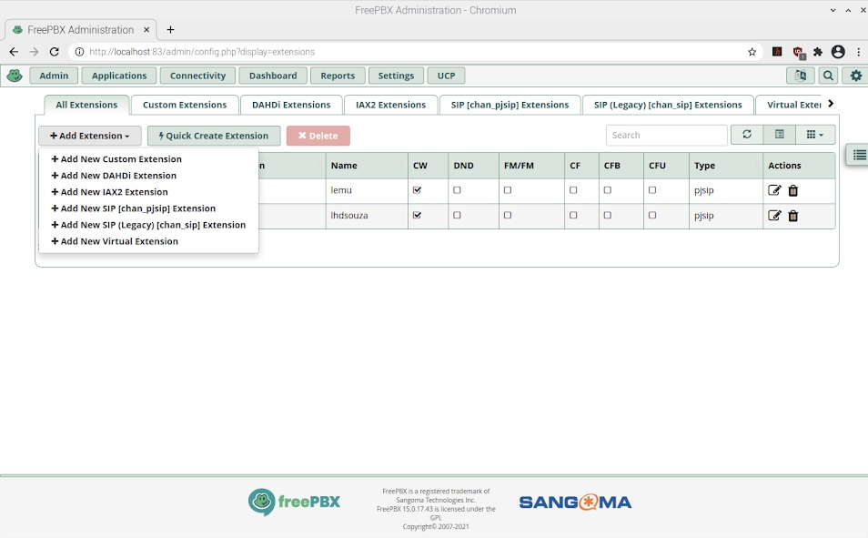

== PBX README

This "pbx" playbook adds https://asterisk.org/[Asterisk] and https://freepbx.org/[FreePBX] to Internet-in-a-Box (IIAB) for VoIP and SIP functionality e.g. for rural telephony.

The initial release (for IIAB 6.7 in February 2019) supported Ubuntu 18.04, Debian 9 "Stretch" — and experimentally, Raspberry Pi: https://github.com/iiab/iiab/issues/1467[#1467]

_2021-08-02 GOOD NEWS: IIAB has upgraded from Asterisk 16.x (released 2018-10-09) to 18.x (released 2020-10-20, https://wiki.asterisk.org/wiki/display/AST/Asterisk+18+Documentation[docs]): https://github.com/iiab/iiab/pull/2896[PR #2896]_

_2021-08-02 WORK IN PROGRESS: The latest versions of Ubuntu (20.04, 20.10, 21.04), Debian 11 "Bullseye" and the imminent Raspberry Pi OS 11 "Bullseye" all include PHP 7.4 — which does not work with FreePBX 15 — so IIAB is making the transition to https://www.freepbx.org/freepbx-16-beta-is-here/[FreePBX 16 Beta^] which emerged on 2021-06-21: https://github.com/iiab/iiab/pull/2899[PR #2899]_

_PLEASE UNDERSTAND THIS MEANS THAT: IIAB no longer supports FreePBX 15 (i.e. Linux distros with PHP <= 7.3, e.g. on Raspberry Pi OS 10 "Buster"). Thank you for your understanding, as we look to the future together!_

=== What Asterisk & FreePBX do?

Asterisk is a software implementation of a private branch exchange (PBX). In conjunction with suitable telephony hardware interfaces and network applications, Asterisk is used to establish and control telephone calls between telecommunication endpoints, such as customary telephone sets, destinations on the public switched telephone network (PSTN), and devices or services on Voice over Internet Protocol (VoIP) networks. Its name comes from the asterisk (*) symbol for a signal used in dual-tone multi-frequency (DTMF) dialing.

FreePBX is a web-based open source GUI (graphical user interface) that controls and manages Asterisk (PBX), the open source communication server.

=== Using it

Prior to using IIAB, make sure your http://wiki.laptop.org/go/IIAB/FAQ#What_is_local_vars.yml_and_how_do_I_customize_it.3F[/etc/iiab/local_vars.yml] contains:
----
pbx_install: True
pbx_enabled: True
----

Optionally, you may want to enable https://github.com/wdoekes/asterisk-chan-dongle[chan_dongle], which is a channel driver for Huawei UMTS cards allowing regular voice calls over GSM. You will need to configure a dongle post-install, for it to be recognized properly:
----
asterisk_chan_dongle: True
----

You have an option of using an Apache (default) or NGINX webserver. To use nginx, add the following line to your http://wiki.laptop.org/go/IIAB/FAQ#What_is_local_vars.yml_and_how_do_I_customize_it.3F[/etc/iiab/local_vars.yml] file
----
pbx_try_nginx: True
----

If using PBX intensively, please adjust `/etc/php/7.4/apache2/php.ini` as outlined within https://github.com/iiab/iiab/blob/master/roles/www_options/tasks/main.yml#L88-L131[/opt/iiab/iiab/roles/www_options/tasks/main.yml] — much like other IIAB Apps that use:
----
nginx_high_php_limits: True
----

After installing PBX as part of IIAB, please visit http://box.lan:83/freepbx and proceed with initial configuration (no login/password is required initially — you will be asked to set this up).

You can monitor the FreePBX service with command:
----
systemctl status freepbx
----

=== Steps to setup a basic working FreePBX configuration with a PJSIP extension

==== Initial configuration

After installing PBX as part of IIAB, please visit http://box.lan:83/freepbx on your browser and proceed with initial configuration. You will be asked to setup your username and password the first time you login which will be used in future to login to the FreePBX configuration screen. Once you login, select the first option 'FreePBX Administrator'.

==== Change the default Asterisk password

Go to Settings >> Asterisk settings. Click on _Submit_ button below and then click _Apply config_ that'll appear in red on the top right side of the web page.
+
image::files/advanced_settings.jpg[]

==== Change Asterisk SIP settings

* Go to Settings >> Asterisk SIP settings >> Under NAT settings, clicking "Detect Network Settings" will populate your external IP Under Local networks, enter your local IP settings in the form of IP/CIDR or IP/NETMASK such as, `192.168.0.0/24` or `192.168.0.0/255.255.255.0`
* Click on _Submit_ button below and then click _Apply config_ that'll appear on the top right side of the web page.
+
image::files/asterisk_sip_settings.jpg[]

==== Create SIP phone extensions to enable you to make calls within your network

* Go to Applications >> Extensions >> Add Extension >> New chan_pjsip extension, and enter the following:
* Extension - _301_
* Display name - _John Doe_
* Secret - _strong password_
* Click on _Submit_ button on the bottom of the page and then click _Apply config_ that'll appear in red on the top right side of the web page.
* Using the same steps, you could create more extensions for other users.
  +

  + 
  +
image::files/add_extn_02.jpg[]

==== Register the extension on your smartphone or laptop

You can now register these extensions using a softphone app on your smartphone. For this example we will use the Linphone app on an Android phone. Once you open the app, follow the steps below:

* Connect to _Internet in a Box_ WiFi on your smartphone or laptop
* Select option _USE SIP ACCOUNT_
* Enter the same details that you set in freepbx web console: _Username_ is the same as _Extension_, _Password_ is the same as _Secret_ and _Domain_ is your asterisk server IP address
* Select _UDP_ option under _Transport_
* Click on Login
  +
image::files/linphone_setup.jpg[]

* If connection is successful, you will see _connected_ with a green circle besides it on the next screen
  +
image::files/linphone_connected.jpg[]
* If you have created more than one extension, make a call to another extension. You will see activity on the applet at the right side of your FreePBX Dashboard. Connection details may also be seen under asterisk logs at: '/var/logs/asterisk/full'

=== Troubleshooting

. Check if Asterisk is up and running
  * sudo asterisk -rvvv
  * The number of v's denote the verbosity level. In this case it is level 3
  * If asterisk is running, it'll successfully take you to the asterisk console

. If you see a _Asterisk is not connected_ in red on the FreePBX web console, check if asterisk is running using this command `systemctl status asterisk` on the terminal. Output should show the status as active(running). If not running, please restart asterisk using the command `sudo fwconsole restart`

. If you see a _fwconsole read_ error when you save settings, execute the command `sudo fwconsole chown` followed by `sudo fwconsole reload` on your terminal

=== Some useful Asterisk commands and information

. `sudo asterisk -rvvvv`
  - To reach asterisk CLI.
  - Note: The number of v's denote the verbosity level. In this case, it is 4

. `asterisk -rx "pjsip show endpoints"`
  - This helps execute a command outside of the CLI, for use in a script

. `core show help`
  - To see all available asterisk commands

. `pjsip show [tab]` or `pjsip show ?`
  - To see all commands that start with `pjsip show`. You may try this with any command to see how to use it.

=== Additional information for using FreePBX

. If you forget your FreePBX password, you could bypass it using the command `sudo fwconsole <session id>` and then refersh the web page. To get the session id, press `Ctrl + a` which will highlight all the text on the page. The text highlighted in the middle of the page, is the session id
  +
image::files/pwdless_login.jpg[]

. Once you've logged in, change your password under Admin >> Administrators. On the right side, you will see the list of available users. You can select the appropriate user and change the password.
  +
image::files/password_change.jpg[]

. User control panel
  - If you'd like to allow users to manage some of their own settings and view their statistics, you need to install _User Control Panel_ from Admin >> Module Admin >> Check online

=== Raspberry Pi known issues

+++<del>+++ As of 2019-02-14, "systemctl restart freepbx" failed more than 50% of the time when run on a http://wiki.laptop.org/go/IIAB/FAQ#What_services_.28IIAB_apps.29_are_suggested_during_installation.3F[BIG-sized] install of IIAB 6.7 on RPi 3 or RPi 3 B+.

+++<del>+++ It is possible that FreePBX restarts much more reliably when run on a MIN-sized install of IIAB?  Please http://wiki.laptop.org/go/IIAB/FAQ#What_are_the_best_places_for_community_support.3F[contact us] if you can assist here in any way: https://github.com/iiab/iiab/issues/1493[#1493]

=== Raspberry Pi Zero W Warning

Node.js applications like Asterisk/FreePBX, Node-RED and Sugarizer won't work on Raspberry Pi Zero W (ARMv6) if you installed Node.js while on RPi 3, 3 B+ (ARMv7) or RPi 4 (ARMv8).  If necessary, run `apt remove nodejs` or `apt purge nodejs` then `rm /etc/apt/sources.list.d/nodesource.list; apt update` then (https://nodered.org/docs/hardware/raspberrypi#swapping-sd-cards[attempt!]) to https://github.com/iiab/iiab/blob/master/roles/nodejs/tasks/main.yml[install Node.js] _on the Raspberry Pi Zero W itself_ (a better approach than "cd /opt/iiab/iiab; ./runrole nodejs" is to try `apt install nodejs` or try installing the tar file mentioned at https://github.com/iiab/iiab/issues/2082#issuecomment-569344617[#2082]).  You might also need `apt install npm`.  Whatever versions of Node.js and npm you install, make sure `/etc/iiab/iiab_state.yml` contains the line `nodejs_installed: True` (add it if nec!)  Finally, proceed to install Asterisk/FreePBX, Node-RED and/or Sugarizer. https://github.com/iiab/iiab/issues/1799[#1799]

Please also check the "Known Issues" at the bottom of https://github.com/iiab/iiab/wiki#our-evolution[IIAB's latest release notes].

=== Attribution

This "pbx" playbook was heavily inspired by Yannik Sembritzki's  https://github.com/Yannik/ansible-role-asterisk[Asterisk] and FreePBX https://github.com/Yannik/ansible-role-freepbx[FreePBX] Ansible work, Thank You!
