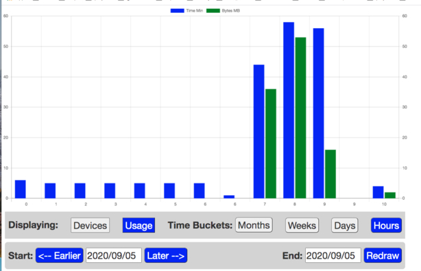
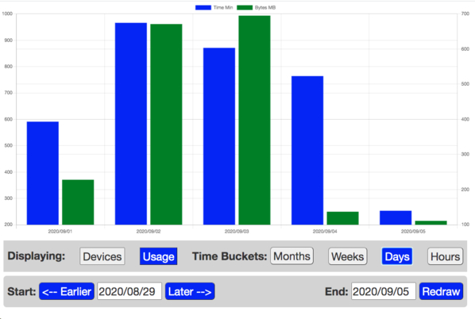

### Usage Statistics Describing WiFi Clients on IIAB Servers
Overview:

The *hostapd* program runs on the IIAB server, and manages all of the WiFi client connections. This **Usage** application records the identity and  byte counts for each connected device once every 2 minutes. It places this information into a sqlite3 databae (/opt/iiab/clientlinfo.sqlite). The information in the database is summarized by a graphical output page at http://box.lan/admin/usage (requires the *Admin Console* username and password).
### What Questions Can the Usage Chart Answer?
The graphical user interface for an application is always a challenge. Here are the questions which the **Usage Chart** may be able to answer:
1. What happened in the classroom today?
    1. How much variation was there between the usage of data between indivitual students?
    2. How much are the computers being used during the day? In which class periods?
2. How does the usage today compare with earlier days, weeks, months?
### Some Examples
There are three main variables which can be selected independently in the **Usage Chart**:
    
1. What is displayed
    1. Computer devices -- even smart phones belonging to students, or classroom visitors  -- in separate bars.
    2. Usage: -- A pair of bars for each bucket:
        1. Number of minutes connected to the server.
        1. Number of megabytes consumed fro the server.
2. The size of the time bucket which is lumped into a set of bars 
3. The start date and end date which will be displayed 
### How to use
Part of the challenge in testing and debugging an application such as **Usage Chart** is accumulating enough data to test the historical charts. The easiest is to accumulate for a few days, and then display the hourly buckets:

This chart
shows that I got up at about 7AM, and read the online NYTimes for quite a while. Then I had breakfast. and started again about 10AM.

Then I clicked the "Days" bucket, which shows how much connection and data I've used while testing this application. My computer stays connected, so the blue bars are always the same, and do not really indicate much useful information. When there is a whole classroom of computers, and some of them might not be turned on part of the time, the number of connection hours might be useful.

